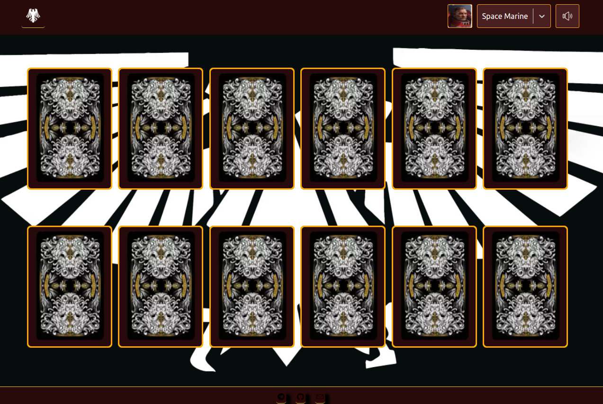

# Memory card -

Карточная игра, где нужно угадать дву одинаковые карты, на лицевой стороне карты изображены персонажи из warhammer 40000.

Этот проект собрал при помощи [Create React App](https://github.com/facebook/create-react-app).

## Запуск

В рабочей дирректории установите зависимости:

### `npm install`

Запуститте проект

### `npm start`

#### Ссылка на проект
https://zippy-naiad-c0d8ef.netlify.app/
